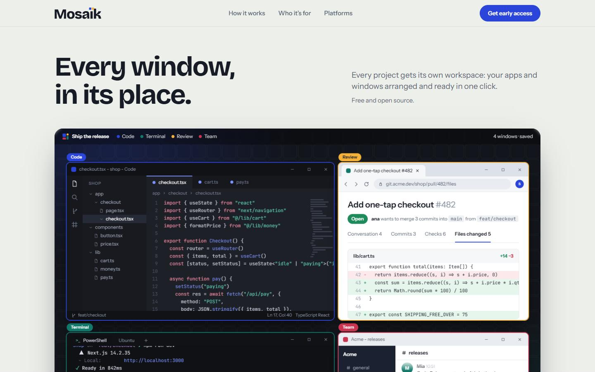
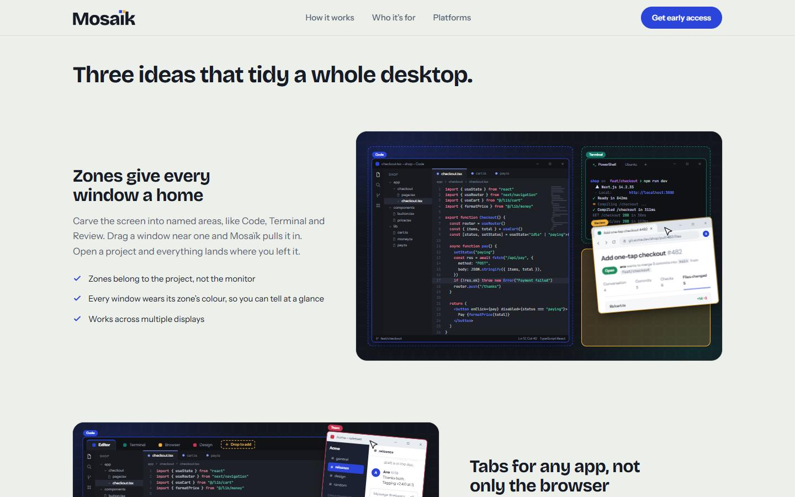
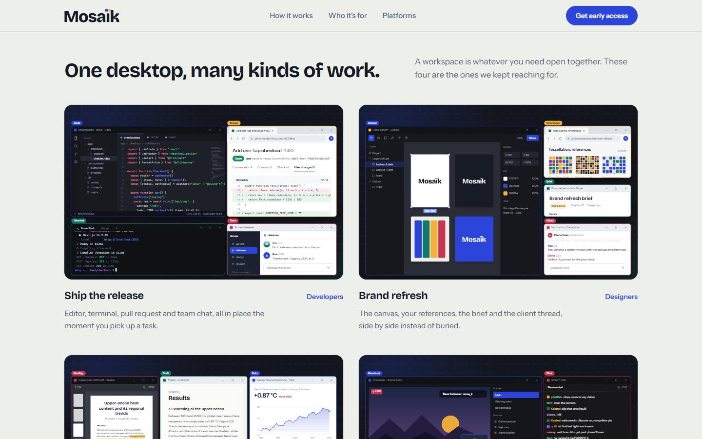
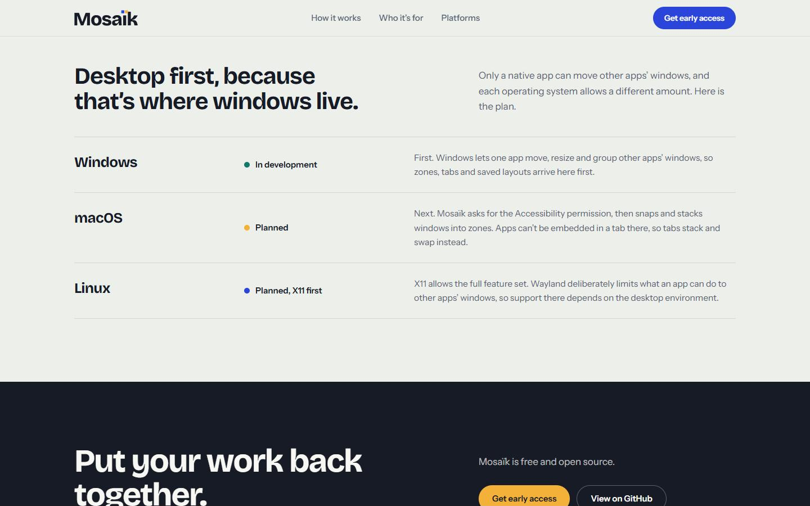

<div align="center">

<h1>Mosaïk</h1>

<h3>Workspace organizer for the desktop</h3>

[](https://nextjs.org)
[](https://typescriptlang.org)
[](https://tailwindcss.com)

<hr>

<h2>About</h2>

<p>Mosaïk gives every project its own workspace:<br>
your apps and windows arranged and ready in one click.<br>
It is free and open source, and still in development.</p>

<p>The desktop app is built Windows first.<br>
For now this repository holds the website at mosaïk.com,<br>
where you can ask for early access.</p>

<hr>

<h2>Screenshots</h2>

<table align="center">
<tr>
<td align="center" width="50%">



<sub>Home</sub>

</td>
<td align="center" width="50%">



<sub>Zones</sub>

</td>
</tr>
<tr>
<td align="center" width="50%">



<sub>Workspaces</sub>

</td>
<td align="center" width="50%">



<sub>Platforms</sub>

</td>
</tr>
</table>

<hr>


<h2>Ideas</h2>

<table align="center">
<tr>
<td align="center" width="33%">

<h3>Zones</h3>

Named screen areas<br>
Code, Terminal, Review<br>
Windows snap in<br>
Zones are per project

</td>
<td align="center" width="33%">

<h3>Tabs</h3>

Tabs for any app,<br>
not only the browser<br>
Saved per workspace<br>
Pull a tab out to make it<br>
a window again

</td>
<td align="center" width="33%">

<h3>Workspaces</h3>

Save a workspace once<br>
Positions, sizes, tabs<br>
return together<br>
Switch by keyboard<br>
Saved locally

</td>
</tr>
</table>

<hr>

<h2>Workspaces for</h2>

<table align="center">
<tr>
<td align="center" width="25%">

<h3>Developers</h3>

Editor<br>
Terminal<br>
Pull request<br>
Team chat

</td>
<td align="center" width="25%">

<h3>Designers</h3>

Canvas<br>
References<br>
The brief<br>
Client thread

</td>
<td align="center" width="25%">

<h3>Researchers</h3>

The paper<br>
The draft<br>
The data

</td>
<td align="center" width="25%">

<h3>Streamers</h3>

Broadcast<br>
Live chat<br>
Dashboards

</td>
</tr>
</table>

<hr>

<h2>Platforms</h2>

<table align="center">
<tr>
<td align="center" width="33%">

<h3>Windows</h3>

<b>In development</b><br>
Zones, tabs and saved<br>
layouts arrive here first

</td>
<td align="center" width="33%">

<h3>macOS</h3>

<b>Planned</b><br>
Needs the Accessibility<br>
permission. Tabs stack<br>
and swap instead<br>
of embedding

</td>
<td align="center" width="33%">

<h3>Linux</h3>

<b>Planned, X11 first</b><br>
X11 allows the full set<br>
Wayland limits what apps<br>
can do to other windows

</td>
</tr>
</table>

<hr>

<h2>Stack</h2>

<p>The website in this repository:</p>

```javascript
const site = {
  app: ["Next.js 16", "React 19", "TypeScript"],
  styling: ["Tailwind CSS 4"],
  fonts: ["Bricolage Grotesque", "Instrument Sans", "JetBrains Mono"]
};
```

<hr>

<h2>Setup</h2>

<p>Needs Node.js 20.9 or newer. No environment variables.</p>

```bash
git clone https://github.com/gimzdev/mosaik.git
cd mosaik

npm install
npm run dev
```

<hr>

[](https://mosaïk.com)

</div>
